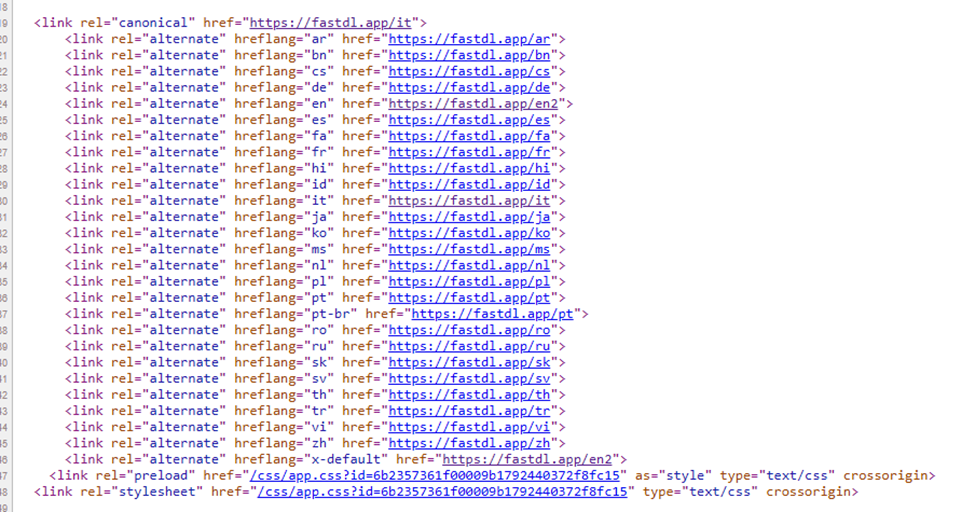

Mistakes
•	When we open https://snapyolo.com/index.php its must be redirect or open simple url like this https://snapyolo.com/ and no index.php in home url when you access via dashboard you will see index.php file as home page so its simple home url.
•	url slug must be like this https://snapyolo.com/id/photo-downloader not like this https://snapyolo.com/photo-downloader/id country code must be in start of the url 
•	when you are any other country url like https://snapyolo.com/photo-downloader/es and again when you click back to other country or select back to en it will give error 404 page not found kindly check it carefully
•	website is not fully responsive when you click on /fr or some other country you will see website is not responsive 
•	some icon not properly visible and showing very big on mobile screen kindly you personally open website in mobile icon very big and out of screen and not fully responsive in all language kindly check it carefully.
•	No language added function in admin panel if I want to add or delete any language my self how I can do it you must add a function to make it fully function to added or deleted any language
•	If I redirect any specific language url like https://snapyolo.com/fr to https://snapyolo.com/fr1 so all pages must be working with specific language only to work with it https://snapyolo.com/fr1/photo-downloader etc automatically redirect fr to fr1 what redirect page we set backend in admin panel 
•	In mobile screens all downloader must be as show icon not dropdown menu as currently you are setting as dropdown menu make like fastdl.app website responsive button 
•	When click on any downloader  in any language its getting very long time to get response to show result I mean its keep loading to change url very long process make it very fast to fast response time execution time is very high check code properly why its like that (very very important)
Now Some SEO Settings Issue
•	No language attribute like as I show you in image
•	 
•	its working like when you are any specific language as above its on Italy page so canonical /it and rest of language show like hreflang attribute its same like when you are any other language like /de then that page is canonical and rest of pages in href language you can get this idea from chatgpt if you are good in seo
•	when you are in specific language meta description and title must be for same language its these shows in that language and also og tags and other tags value in same language not by default for English for every language (it is very very important point)
•	same like scheme markup also do the same job to put same language value as dynamic  value change what language you are and schema markup show the same language content not by default for english you can check fastdl.app as reference
•	you just follow fastdl.app website to get all ides about these seo point and check everything carefully and understand it then put in our website 
•	current set no index no follow attribute in our all website so currently our website not follow google to index because its not yet complete so I don’t want to index my website so make sure all pages that meta tags noindex nofollow
•	lot of meta tags missing kindly check all meta tags from fastdl.app website and put the same metatags in our website for all pages and dynamic value change according to what user select language
•	no page or any url show .php at the end of url all the dynamic url and seo friendly like check fastdl.app website as reference 
•	my more focus on seo settings and you also check for that and I m also checking more and let you know kindly 1st fix all these point and let me know 
•	
•	
•	

